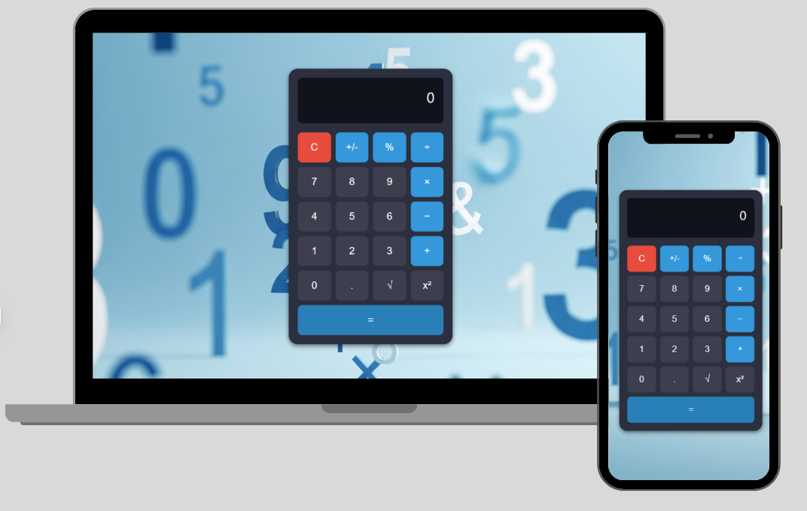

# 🧮 Calculadora com JavaScript

Este é um projeto de calculadora desenvolvida com **HTML, CSS e JavaScript puro**, como parte dos meus estudos de Front-End.

## 🔧 Funcionalidades

- Operações básicas: +, -, *, /
- Porcentagem (%)
- Potência (x²)
- Raiz quadrada (√)
- Inverter sinal (+/-)
- Decimal
- Limpar e calcular (=)

  ## 📸 Capturas de Tela



## 🎨 Layout

- Design responsivo
- Fundo personalizado com visual moderno (futurista/digital)
- Estilo minimalista com foco na usabilidade

  ## 🛠️ Tecnologias Utilizadas

- 💻 **Visual Studio Code** – Ambiente de desenvolvimento
- 🌐 **HTML5**
- 🎨 **CSS3**
- ⚙️ **JavaScript (ES6+)**


## 🚀 Como rodar

Clone o repositório e abra o `index.html` no navegador.

```bash
git clone [ https://github.com/seuusuario/nome-do-repositorio.git](https://github.com/JardsonFlorentino/Calculadora)

Abra o arquivo index.html no seu navegador.

## 📁 Estrutura de Pastas

```bash
├── index.html
├── style.css
├── script.js
├── assets/
│ ├── preview.jpg
│ └── icons, flags etc.
```


📌 Observações

Este projeto foi feito com fins educacionais.

🙋‍♂️ Autor
Desenvolvido por Jardson

[Meu LinkedIn](https://www.linkedin.com/in/jardsonflorentino) | [Meu GitHub](https://github.com/JardsonFlorentino)

